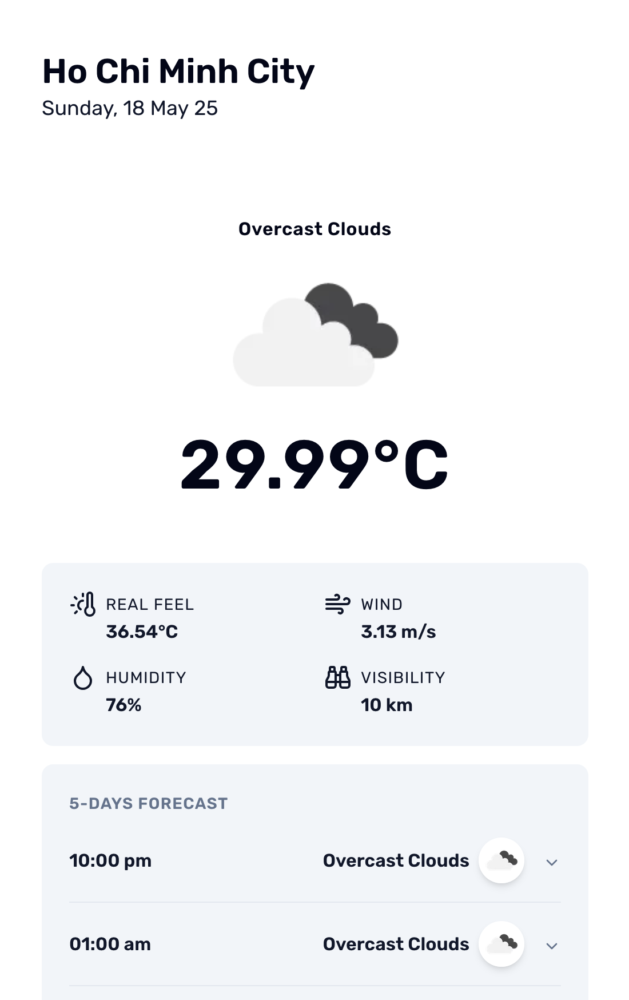

# Weather App

## 🔗 Live Preview

👉 [weather-app-phi-nine-51.vercel.app](https://weather-app-phi-nine-51.vercel.app)



## Overview

This project is a weather application built with ReactJs and NextJs. It demonstrates modern React patterns, API integration, and UI component design.

## Features

🌤️ Current Weather Summary

- Shows date, icon, temperature, description, humidity, wind speed (with direction), and visibility.

📅 5-day Forecast (3-hour Intervals)

- Displays forecast with time, icon, max/min temps, and description. Groups data by day using OpenWeather API.

🔍 Search & History

- Search for city weather
- Handle valid/invalid input
- Save & display past searches
- Reuse or delete search history

## Tech Stack

- [ReactJs](https://react.dev/)
- [NextJs](https://nextjs.org/)
- [TypeScript](https://www.typescriptlang.org/)
- [Tailwind CSS](https://tailwindcss.com/) (if used)
- [ESLint](https://eslint.org/) & [Prettier](https://prettier.io/) for code quality

## Getting Started

1. **Install dependencies:**

   ```sh
   pnpm install
   ```

2. **Set up environment variables:**

   - Create `.env` and fill in required API keys.
   - Example:

   ```
   OPEN_WEATHER_API_KEY=89cd93312734c3864d3a0cbd89f83868
   ```

3. **Run the development server:**
   ```sh
   pnpm dev
   ```
   The app will be available at [http://localhost:3000](http://localhost:3000).

## Project Structure

```
apps/weather-app/
  app/           # NextJs app directory
  components/    # Reusable UI components
  hooks/         # Custom React hooks
  lib/           # Init by "shadcn/ui"
  services/      # API service logic
  utils/         # Helper utilities
```

## Scripts

- `pnpm dev` – Start development server
- `pnpm build` – Build for production
- `pnpm lint` – Run linter

## Notes

- Please review code comments for explanations of key decisions.
- For any questions, contact [red8paw@gmail.com](mailto:red8paw@gmail.com).

---

**Good luck reviewing!**
